<div align="center">

# 🌍 TERRAFLOW PLATFORM
**Intelligent IoT Solution for Precision Agriculture & Environmental Monitoring**

<p align="center">
  
  
  
</p>

<p align="center">
  <a href="https://nextjs.org">
    
  </a>
  <a href="https://go.dev">
    
  </a>
  <a href="https://firebase.google.com/">
    
  </a>
  <a href="https://docker.com">
    
  </a>
</p>

<br/>


<br>

[📖 Dokumentasi API](docs/DocsAPI.md) &nbsp; • &nbsp; [🐛 Laporkan Bug](https://github.com/arfazrll/terraflowplatform/issues) &nbsp; • &nbsp; [🚀 Live Demo](https://terraflow.io)

</div>

---

## 📋 Ikhtisar Proyek

**TerraFlow Platform** adalah sistem pemantauan lingkungan berbasis IoT yang efisien dan responsif. Sistem ini dirancang dengan arsitektur **Direct-to-Cloud**, di mana perangkat sensor berkomunikasi langsung dengan Firebase Realtime Database melalui HTTP, memastikan sinkronisasi data yang cepat antara lahan fisik dan dashboard digital.

Backend dibangun menggunakan **Go (Gin Framework)** untuk manajemen konfigurasi yang cepat, sementara Frontend menggunakan **Next.js** untuk visualisasi data interaktif.

---

## 🏗️ Arsitektur Sistem

Berdasarkan kode sumber aktual, berikut adalah alur data yang benar:

```mermaid
graph LR
    subgraph "Device Layer (ESP32)"
    A["📡 Sensor Node"] -->|HTTP PUT| B[("🔥 Firebase Realtime DB")]
    A -->|HTTP GET| B
    end

    subgraph "Cloud / Data Layer"
    B
    end

    subgraph "User Interface"
    C["🖥️ Next.js Dashboard"] <-->|Firebase SDK| B
    end

    subgraph "Support Services"
    D["⚡ Backend API (Go)"] -->|Serve Config / Health| C
    end
    
    style A fill:#f9f,stroke:#333,stroke-width:2px
    style B fill:#ffca28,stroke:#333,stroke-width:2px,color:black
    style C fill:#bfb,stroke:#333,stroke-width:2px
    style D fill:#bbf,stroke:#333,stroke-width:2px
```



1. **Sensing:** ESP32 membaca sensor (Ultrasonic/pH) dan mengirim data via **HTTP Client** langsung ke Firebase endpoint (`.json`).
2. **Actuating:** ESP32 secara berkala membaca status kontrol (Pompa/Servo) dari Firebase untuk eksekusi perintah jarak jauh.
3. **Monitoring:** Frontend terhubung ke Firebase untuk menampilkan perubahan data secara *real-time*.
4. **Configuration:** Backend Go menyediakan endpoint sentral untuk konfigurasi aplikasi.

---

## ✨ Fitur Utama

### 🤖 Firmware Cerdas (ESP32)

* **Direct HTTP Communication:** Pengiriman data efisien menggunakan library `HTTPClient.h` langsung ke REST API Firebase.
* **Smart Control Logic:** Otomatisasi pompa dan servo berdasarkan pembacaan sensor (Contoh: Pompa aktif jika air surut).
* **Robust Connectivity:** Fitur *Auto-Reconnect* WiFi dan mekanisme *Retry* saat pengiriman data gagal.
* **Remote Control:** Dukungan mode manual untuk mengendalikan Servo dan Pompa dari dashboard.

### 🖥️ Frontend Modern (Next.js)

* **Real-time Visualization:** Grafik dinamis menggunakan `recharts` yang bereaksi instan terhadap perubahan data di Firebase.
* **Interactive UI:** Dibangun dengan React 19 & Tailwind CSS untuk tampilan yang bersih dan responsif.
* **3D Elements:** Integrasi `react-three-fiber` untuk visualisasi elemen 3D (jika diaktifkan).

### ⚡ Backend Ringan (Go)

* **High Performance:** API Server berbasis **Gin Gonic** yang super cepat dan hemat memori.
* **Configuration Management:** Endpoint `/api/config` untuk mendistribusikan kredensial Firebase secara aman ke client yang terautentikasi.
* **Health Monitoring:** Endpoint `/health` untuk pemeriksaan status layanan di container Docker.

---

## 🛠️ Panduan Instalasi (Docker)

Jalankan seluruh ekosistem (Frontend & Backend) menggunakan Docker Compose.

### Prasyarat

* [Docker Desktop](https://www.google.com/search?q=https://www.docker.com/products/docker-desktop)
* Akun Firebase (Realtime Database sudah di-setup)

### Langkah 1: Persiapan Environment

Buat file `.env` di folder `deployments/` atau root project dengan isi kredensial Firebase Anda:

```env
PORT=8080
ALLOWED_ORIGINS=http://localhost:3000
FIREBASE_API_KEY=your_api_key
FIREBASE_AUTH_DOMAIN=your_project.firebaseapp.com
FIREBASE_DATABASE_URL=https://your_project.firebaseio.com
FIREBASE_PROJECT_ID=your_project_id
# ... variable lain sesuai docker-compose.yml
```

### Langkah 2: Jalankan Container

```bash
cd deployments
docker-compose up -d --build
```

### Langkah 3: Akses Aplikasi

* **Dashboard:** Buka `http://localhost:3000`
* **Backend API:** Buka `http://localhost:8080/health` (Untuk cek status)

---

## 📡 Konfigurasi Hardware (ESP32)

Kode firmware ada di `firmware/esp32_sensor/src/main.cpp`.

1. Buka folder `firmware/esp32_sensor` dengan VS Code + PlatformIO.
2. Edit file `include/secrets.h` (buat jika belum ada) untuk kredensial WiFi dan Host Firebase:
```cpp
#define WIFI_SSID "NamaWiFiAnda"
#define WIFI_PASSWORD "PasswordWiFi"
#define FIREBASE_HOST "[https://project-id.firebaseio.com](https://project-id.firebaseio.com)" 
```

3. Upload ke board ESP32.

**Pin Mapping (Default):**

* `TRIG_PIN`: 19, `ECHO_PIN`: 18 (Ultrasonic)
* `PH_SENSOR`: 35
* `SERVO`: 21
* `PUMP`: 25
* `BUZZER`: 13

---

## 📂 Struktur Direktori

```bash
terraflow-platform/
├── 📂 backend/             # Layanan API (Go + Gin)
│   ├── main.go             # Server config & utility
│   └── Dockerfile          # Container setup
├── 📂 deployments/         # Konfigurasi Infrastruktur
│   ├── docker-compose.yml  # Orkestrasi Frontend & Backend
│   └── .env.example        # Template variabel environment
├── 📂 firmware/            # Kode Mikrokontroler (C++)
│   └── esp32_sensor/       # Project PlatformIO
│       ├── src/main.cpp    # Logika sensor & HTTP Client
│       └── platformio.ini  # Dependensi library
└── 📂 frontend/            # Dashboard App (Next.js)
    ├── src/app/            # Halaman & Routing
    ├── src/lib/firebase.ts # Inisialisasi Firebase Client
    └── public/             # Aset gambar & ikon
```

---

<div align="center">

<p><b>TerraFlow Platform</b> - Precision Farming Made Simple.</p>

</div>
